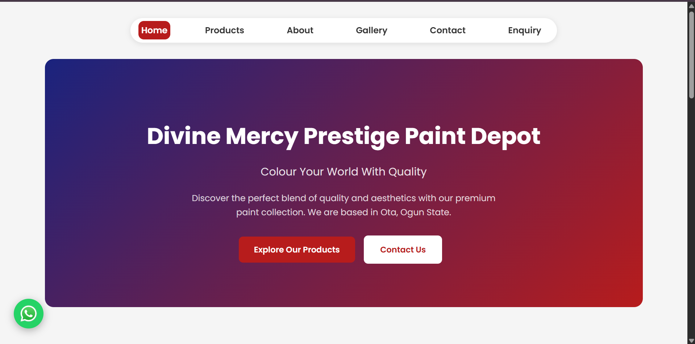

# 🎨 Divine Mercy Prestige Paint Depot

A modern, responsive business website built for **Divine Mercy Prestige Paint Depot**, a premium paint company based in Ota, Ogun State, Nigeria. The website showcases the company's products, gallery, and contact information while providing a clean and user-friendly experience across all devices.

---

## 🌐 Live Demo

👉 https://prestigepaintdepot.com

---

## 📸 Preview



---

## ✨ Features

- 🎨 Modern and responsive design
- 📱 Mobile-friendly navigation
- 🛍️ Product showcase section
- 🖼️ Gallery section
- 📞 Contact & enquiry section
- 💬 WhatsApp integration
- ⚡ Smooth scrolling navigation
- 🚀 Fast loading performance
- 🔍 SEO optimized

---

## 🛠️ Built With

- HTML5
- CSS3
- JavaScript

---

## 📂 Project Structure

```text
prestige-paint/
│
├── assets/
│   └── images/
│       └── prestige-preview.jpg
│
├── css/
├── js/
├── index.html
└── README.md
```

---

## 🚀 Getting Started

Clone the repository:

```bash
git clone https://github.com/ajagbegideon/prestige-paint.git
```

Open the project folder and launch `index.html` in your browser.

---

## 🎯 Purpose

This project was developed to provide Divine Mercy Prestige Paint Depot with a professional online presence where customers can:

- Explore available paint products
- View the company gallery
- Contact the business easily
- Send enquiries through the website

---

## 👨‍💻 Author

**Ajagbe Gideon**

- 🌐 Portfolio: https://gideon-ajagbe.vercel.app
- 💼 LinkedIn: https://linkedin.com/in/ajagbegideon
- 📧 Email: ajagbegideon6@gmail.com

---

## 📄 License

This project is for portfolio and business demonstration purposes.
